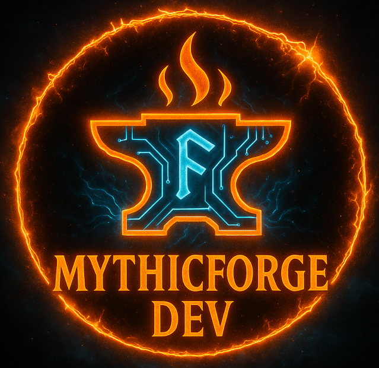

  

<h1 align="center">MythicForgeDev</h1>

  🔥 Forging powerful systems at the edge of logic and madness. 
  ⚙️ Built with Python and dangerous amounts of caffeine. 
  🧙‍♂️ Home of <b>MythicJourney</b> and other arcane artifacts.

<h2 align="center">🧭 About</h2>

  <b>MythicForgeDev</b> is a digital forge where raw ideas are beaten into elegant code, 
  and chaos is shaped into clean, modular architecture.  
  The forge is heating up. The fires are lit. The myth... is waking.

  <a href="https://mythicforge.dev">🌐 mythicforge.dev</a>

